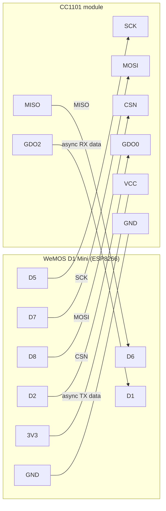

# ESP8266 + CC1101 318 MHz Multifunction Tool

A browser-controlled 318 MHz (300–348 MHz band) sub-GHz analysis and replay tool
built on a WeMOS/LOLIN D1 Mini (ESP8266) and a CC1101 transceiver. It provides an
RSSI spectrum sweep, raw OOK/ASK capture and replay, pulse-timing analysis, and
focused recognizers for Linear 10-bit, MegaCode 24-bit, and EV1527/PT2262
garage/gate remotes.

The original target is a MegaCode-style garage door remote at 318.000 MHz, but
anything in the CC1101 300–348 MHz range can be tuned, captured, and replayed.

> **Legal note:** Only capture and replay signals from devices you own or are
> explicitly authorized to test. RF transmission is regulated; you are
> responsible for complying with local law.

## Hardware

| Function | CC1101 pin | D1 Mini pin | GPIO |
|----------|-----------|-------------|------|
| SPI SCK  | SCK   | D5 | GPIO14 |
| SPI MISO | MISO  | D6 | GPIO12 |
| SPI MOSI | MOSI  | D7 | GPIO13 |
| SPI CSN  | CSN   | D8 | GPIO15 |
| Async TX data in  | GDO0 | D2 | GPIO4 |
| Async RX data out | GDO2 | D1 | GPIO5 |
| Power | VCC | 3V3 | — |
| Ground | GND | GND | — |



RX capture (GDO2 → D1) and TX playback (D2 → GDO0) use separate MCU pins so the
two paths never contend. The CC1101 runs in asynchronous serial mode
(`PKTFORMAT=3`), ASK/OOK modulation, no sync/preamble/whitening/Manchester/FEC/CRC.

Power the CC1101 from 3V3 only — its I/O is **not** 5 V tolerant. A quarter-wave
whip for the target band (~24 cm at 318 MHz, or a tuned helical) on the module's
ANT pad markedly improves both capture and replay range.

## Two-board setup

| Board | PlatformIO env | Role |
|-------|----------------|------|
| D1 Mini + CC1101 | `d1_mini` (`d1_mini_debug` adds serial trace) | the tool: sweep / capture / replay / dashboard / HTTP API |
| D1 Mini + SSD1306 OLED + 2 buttons | `d1_mini_remote` | Wi-Fi remote: shows the tool's status, fires the gates |

The remote joins the main unit's SoftAP (`cc1101-setup-<chipId>`) using the same
`ap_pass` from `secrets.ini`, so the two are **paired by default** once both are
flashed from the same checkout. See "Wi-Fi remote" below (WIP).

Right firmware → right board: when both are plugged in, `pio` autodetect can
pick the wrong one. Copy `ports.ini.example` → `ports.ini` (git-ignored) and pin
each env's `upload_port` to a `/dev/serial/by-path/…` path — find them with
`pio device list` (the `LOCATION`) and `ls -l /dev/serial/by-path/`.

## Software

- **PlatformIO** with the Arduino framework (`platformio.ini`, board `d1_mini`).
- Main unit: `lsatan/SmartRC-CC1101-Driver-Lib`; remote: ThingPulse SSD1306.
- On-device storage: LittleFS (holds saved raw samples as `rf315_<name>.bin`).
- Web server: `ESP8266WebServer` on port 80, plus mDNS.

### Configure Wi-Fi, then build & flash

Credentials are **not** in source. Copy the template and fill it in:

```bash
cp secrets.ini.example secrets.ini   # git-ignored; edit with your values
```

```ini
# secrets.ini
[wifi]
sta_ssid = your-2g4-network
sta_pass = your-wifi-password
ap_ssid  = cc1101-setup
ap_pass  = pick-a-strong-passphrase   # >= 8 chars, or "" for an open AP
```

PlatformIO injects these as `CFG_WIFI_*` defines (`platformio.ini` →
`extra_configs`). If `secrets.ini` is missing, the placeholder values in
`platformio.ini` are used, the firmware still builds, and only the SoftAP comes
up (the station join just fails).

```bash
pio run -e d1_mini            # build (default)
pio run -e d1_mini -t upload  # flash over USB
pio run -e d1_mini_debug -t upload   # same firmware + serial tracing
pio device monitor -b 115200  # watch traces (d1_mini_debug only)
```

### Uploading to the D1 Mini

- Plug the board in with a **data** USB cable; the D1 Mini enters flash mode on
  its own (no buttons to hold).
- `pio run -t upload` auto-detects the port. Force one with
  `pio run -t upload --upload-port /dev/ttyUSB0` (Linux) /
  `COM5` (Windows) / `/dev/cu.usbserial-*` (macOS).
- To speed flashing add `upload_speed = 921600` under `[env:d1_mini]`.
- The ESP8266 boot ROM logs at 74880 baud: `pio device monitor -b 74880`.
- If the port doesn't appear on Linux you likely need the CH340 driver and
  membership in the `dialout` group.

### Testing against a real device

`tools/rfprobe.py` is a stdlib-only CLI for the HTTP API, and `tests/` is a
pytest suite that runs only when a flashed, networked module is reachable:

```bash
tools/rfprobe.py --host cc1101.local selftest
tools/rfprobe.py sweep 317.7 318.3 --json | jq .summary
tools/rfprobe.py export gate.sub --sample inner_gate   # Flipper RAW / .csv / .txt

python -m pip install -r requirements-dev.txt
pytest                                  # decode-port unit tests always run;
                                        # device tests need CC1101_HOST
CC1101_HOST=cc1101.local pytest         # + the on-device checks
ruff check .                            # lint tools/ tests/ scripts/
```

The decode pipeline in `src/decode.cpp` is mirrored by `tools/rfdecode.py`,
which `tests/test_rfdecode.py` exercises directly and a device test
cross-checks against a live capture. There is no host build of the firmware —
it targets the ESP8266.

See `tests/README.md`.

### Reaching the dashboard

The device runs **concurrent AP + station** (`WIFI_AP_STA`): it always hosts its
own access point *and* keeps trying to join your home network.

| Path | URL |
|------|-----|
| Via your network (mDNS) | `http://cc1101.local/` |
| Via your network (DHCP) | address shown by your router / on `/api/status` |
| Direct — join the SoftAP from a phone | `http://192.168.4.1/` (or just wait for the captive-portal prompt) |

The SoftAP SSID is `<ap_ssid>-<chip-id>` (e.g. `cc1101-setup-a1b2c3`) so nearby
units don't collide; the exact name is on `/api/status` (`apSsid`) and in the
dashboard status row. A DNS catch-all + redirect on the AP makes the phone's
"sign in to network" sheet open the dashboard automatically.

The same web server answers on both interfaces. The SoftAP stays up even when
the home network is out of range, so the dashboard is always reachable.

> **Credential history:** early commits once carried Wi-Fi credentials inline in
> `src/main.cpp`. That history was squashed into the "Initial import" commit and
> the reflog expired + `gc`d on 2026-09-01 — no commit in this repo contains a
> real credential (verified by a full object scan). The SoftAP password was
> rotated. The **station Wi-Fi password was exposed on the build machine before
> the scrub**, so treat it as compromised and rotate it on the router.

## Web UI

Single self-contained page served from PROGMEM. A status row across the top shows
radio state, current mode, station Wi-Fi (SSID / IP / RSSI), SoftAP (SSID / IP /
connected client count), and free heap. Sections:

- **Target frequency** – tune to an exact MHz value, pick capture bandwidth
  (58 / 270 / 650 kHz), and nudge ±5/20/100 kHz.
- **Frequency population / RSSI sweep** – sweep a start/stop range at a given
  step, dwell, and RX bandwidth; bar-graph spectrum with the 8 strongest bins,
  the peak's offset vs the target, and a "Tune to peak" button.
- **Raw record** – capture raw OOK edges from GDO2 with an auto-stop timeout,
  then decode or save.
- **Capture / decoder parameters** – async data rate, TX power, minimum pulse
  width, and the MegaCode timing window (pulse, symbol, frame gap, header).
  Stored in the browser's `localStorage` and pushed to the device.
- **Decode** – JSON result of the generic timing analysis plus any focused
  protocol match, and a rolling-code advisory when a long unmatched code is
  seen (a replay of a KeeLoq/AES remote won't re-open the device).
- **Stored samples** – list / load / decode / play / rename / delete saved
  captures. Playback supports 1–10 repeats and logic inversion.

Below the status row: an info line (firmware version/build, CC1101 version,
LittleFS usage), a **Self-test** button (`/api/selftest`), and a **Gate control**
link that opens `/gate` (see below).

## HTTP API

All endpoints return JSON (`{"ok":true,...}` or `{"ok":false,"error":"..."}`).
The analysis endpoints below are `GET`; the gate-control write endpoints are
`POST`. `409 busy` is returned while a capture, sweep, or playback is running.

| Endpoint | Purpose |
|----------|---------|
| `/api/status` | Firmware version/build, CC1101 partnum/version, Wi-Fi / SoftAP / capture / sweep state, heap, LittleFS usage |
| `/api/selftest` | One-call health check: SPI, radio version, LittleFS, heap, network → `{ok, checks:{…}}` |
| `/api/config?...` | Set runtime data rate, TX power, and decoder timing params |
| `/api/tune?hz=&bw=` | Set target frequency (Hz) and bandwidth (kHz) |
| `/api/nudge?delta=` | Shift target frequency by delta Hz |
| `/api/sweep/start?start=&stop=&step=&dwell=&bw=` | Begin an RSSI sweep |
| `/api/sweep/data` | Sweep results: `count`, `points:[{hz,rssi}]`, `summary:{rssiMin/Max/MeanDbm,peakHz}` |
| `/api/capture/start?ms=` | Begin raw capture with auto-stop (50–10000 ms) |
| `/api/capture/stop` | Stop capture now |
| `/api/capture/histogram` | Pulse-width histogram (28 bins, high/low split) |
| `/api/capture/pulses` | Raw pulse list `[[durationUs,level],…]` (streamed), plus `truncated` |
| `/api/decode/current` | Analyze the in-memory capture |
| `/api/sample/save?name=` | Save current capture to LittleFS |
| `/api/sample/load?name=` | Load a saved sample into memory |
| `/api/sample/decode?name=` | Load and analyze a saved sample |
| `/api/sample/play?name=&repeat=&invert=` | Timer1 raw replay of a saved sample |
| `/api/sample/delete?name=` | Delete a saved sample |
| `/api/sample/rename?from=&to=` | Rename a saved sample (updates gate assignments) |
| `/api/samples` | List saved samples with header metadata |

### Gate control

A separate, deliberately minimal operator surface for actuating two gates.

| Endpoint | Method | Purpose |
|----------|--------|---------|
| `/gate` | GET | Two-button operator page: **Inner gate** / **Outer gate** |
| `/gate/config` | GET | Assign a saved sample + radio settings to each button |
| `/api/gate` | GET | Assignments, resolved sample state, `enabled`, `lastFireError`, forced-power/min-repeat |
| `/api/gate/assign` | POST | Set a button's `sampleName`, `frequencyHz`, `bandwidthKhz`, `repeats`, `invert` (empty `sampleName` clears it) |
| `/api/gate/enable?on=0\|1` | POST | Enable / disable the operator page and `fire` |
| `/api/gate/fire?which=inner\|outer` | POST | Replay that button's assigned sample |

- The POST endpoints reject cross-origin requests (an `Origin` header whose host
  doesn't match `Host`). `/api/gate/fire` returns `409 busy` during any capture,
  sweep, or playback, or `403` when gate control is disabled.
- Assignments + the enabled flag persist to LittleFS as `/gate.bin` (packed
  `"GATE"` v2 record, one `GateAssignment` per button; a v1 file is read as
  "enabled") and are loaded on boot. A missing file or a since-deleted sample
  leaves that button unassigned; a fire that then fails sets `lastFireError`,
  which the operator page shows on its next poll.
- **Every gate fire forces the CC1101 to its maximum output power (+12 dBm),**
  regardless of the stored per-assignment value, because the module has a
  mismatched/stub antenna and marginal RF matching. Repeats are floored at 4.
  After the burst the dashboard's target frequency and RX state are restored.
- Picking a sample on `/gate/config` auto-fills the frequency from that sample's
  capture.
- Served on both the station and SoftAP interfaces, so the gate page works from
  a phone joined to `cc1101-setup` with no other network.

> There is still **no authentication** — anyone who can reach the device (LAN or
> SoftAP) can actuate the gates while it is enabled. The enable toggle and a
> future PIN are tracked in `TASKS.md`.

## Wi-Fi remote (second D1 Mini)

A second board runs `src/remote/` (env `d1_mini_remote`) as a paired remote:

| Wiring | |
|--------|--|
| SSD1306 128×64 OLED | I²C — SDA→D2/GPIO4, SCL→D1/GPIO5, addr `0x3C` |
| Button A (inner gate) | D5/GPIO14 → GND (`INPUT_PULLUP`) |
| Button B (outer gate) | D6/GPIO12 → GND |
| Status LED | onboard D4/GPIO2 |

On boot it scans for the strongest SSID starting with `<ap_ssid>-`, joins it
with `ap_pass` (both from the same `secrets.ini` that built the main firmware —
**paired by default**), then polls `http://192.168.4.1/api/status` and
`/api/gate` every ~1.5 s. A button press does `POST /api/gate/fire?which=…` and
shows the result.

**OLED:** no Wi-Fi link / no reply → big **OFFLINE**; linked → the node's
**idle / SENDING / BUSY** state and, per button, the assigned sample name +
**READY** flag.

**LED** (the indicator when headless): offline → slow dim pulse; online → slow
mid-brightness pulse; button A → fast single-pulse loop; button B → fast
double-pulse with a long gap.

Envs: **`d1_mini_remote`** (OLED), **`d1_mini_remote_headless`** (serial + LED),
**`d1_mini_remote_selftest`** (headless + verbose serial + a loop that dumps
every node endpoint and drives `/api/tune` and `/api/capture/start` to confirm
the node's state changes; live assigned gates are skipped unless built with
`-DREMOTE_SELFTEST_FIRE`).

The remote also serves a tiny HTTP surface **on its own IP** (on the main
unit's SoftAP subnet):

| Endpoint | Purpose |
|----------|---------|
| `GET /api/remote/status` | role, `linkUp`, `joinedSsid`, `mainReachable`, `lastPollAgeMs`, and a cached copy of the main unit's status |
| `POST /api/remote/press?which=inner\|outer` | fire the gate via the main unit and return `{ok, via:"remote", main:{…}}` — the remote-trigger healthcheck |
| `GET /` | one-page status + Inner/Outer buttons |

Pin the right firmware to the right board with `ports.ini` (see the two-board
section above).

## How it works

### Capture
`rawEdgeISR` on GDO2 (CHANGE interrupt) timestamps every edge with `micros()`,
discards pulses shorter than `minPulseUs`, and stores explicit level + duration
pairs (up to `MAX_PULSES = 3072`). After stop, `normalizeCapture()` merges
same-level runs.

### Analysis (`decodeCurrentJson`)
2-means clustering of pulse widths (overall, and per HIGH/LOW level) classifies
the encoding family (pulse-distance/PPM, pulse-width/PWM, complementary pairs),
emits a best-effort candidate bitstring (normal and inverted), and runs three
focused recognizers (in `src/decode.cpp`, mirrored + unit-tested in
`tools/rfdecode.py`):

- **Linear 10-bit** – ~500/1500 µs pulse pairs with a ~21 ms frame guard.
- **MegaCode 24-bit** – ~1 ms pulse in a 6 ms PPM frame, 13 ms header low,
  leading `1` start bit; decodes facility / serial / button fields.
- **EV1527 / PT2262 24-bit** – ~31·Te sync gap then 24 short-long/long-short
  bits; Te derived from the sync gap; reports Te, 20-bit address, 4-bit button.

### Replay (`replayCurrent`)
Timer1 in one-shot mode (5 MHz / `TIM_DIV16`, 5 ticks per µs) drives GDO0 through
the stored level/duration list while the CC1101 is in TX. 1–10 repeats with an
optional logic inversion.

### Sample file format
`#pragma pack(1)` — 20-byte `SampleHeader` (`"315R"` magic, version 1,
frequencyHz, pulseCount, durationUs) followed by `pulseCount` × 5-byte
`DiskPulse` (`uint32 durationUs`, `uint8 level`).

## Repository layout

```
platformio.ini        PlatformIO project: d1_mini / d1_mini_debug / d1_mini_remote
scripts/version.py    pre-build: injects `git describe` as the firmware version
secrets.ini.example   Wi-Fi credential template -> copy to secrets.ini (git-ignored)
ports.ini.example     per-env upload_port pinning -> copy to ports.ini (git-ignored)
src/remote/           the Wi-Fi remote firmware (d1_mini_remote env)
src/main.cpp           Firmware: hardware, Wi-Fi, web UI, HTTP API, JSON glue
src/decode.{h,cpp}     Pure pulse-timing kernels (clustering, recognizers, histogram)
src/notes.md           Reference notes on MegaCode / Flipper OOK650 preset
docs/sample-format.md  On-disk layout of rf315_*.bin capture files
tools/rfprobe.py       Host-side HTTP API client / CLI (stdlib only)
tools/rfdecode.py      Pure-Python port of the firmware pulse analysis (cross-check)
tests/                 pytest suite (pure tests always run; device tests need a board)
.github/workflows/     CI: firmware build (d1_mini + debug) + ruff + pytest
```

See `PROGRESS.md` for current status and `TASKS.md` for the backlog.
